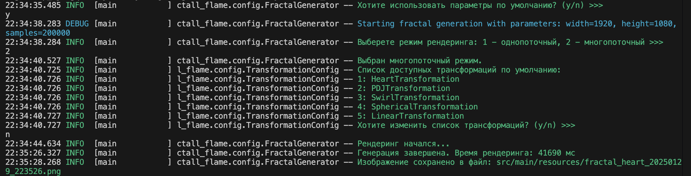

# 4-ый Проект Академии Бэкенда, направление Java

#### Глобально после компиляции проекта и запуска Main.java нужно следовать инструкции в консоле. На картинке видно, как это выглядит


### Этапы
- параметры генерации фрактала(изменить/использовать по умолчанию)
- выбор режима(однопоточный/многопоточный)
- использование модификаций по умолчанию(да/нет)
- если предыдущий пункт выбран "нет", тогда можно добавить и удалить трансформации
- после всех изменений запускается алгоритм генерации фрактала с выставленными параметрами. Сопровождается фразой "Рендеринг начался..."
- После заверешения работы алгоритма, выдается время его работы, а также информация о сохранении изображения. Далее по имени его можно будет найти в папке ```src/main/resources```

## Некоторые примеры получившихся фракталов


### Основные команды для работы с ```maven```

Запуск только компиляции основных классов:

```shell
mvn compile
```

Запуск тестов:

```shell
mvn test
```

Запуск линтеров:

```shell
mvn checkstyle:check modernizer:modernizer spotbugs:check pmd:check pmd:cpd-check
```

Вывод дерева зависимостей проекта (полезно при отладке транзитивных
зависимостей):

```shell
mvn dependency:tree
```

Вывод вспомогательной информации о любом плагине (вместо `compiler` можно
подставить интересующий вас плагин):

```shell
mvn help:describe -Dplugin=compiler
```

## Дополнительные материалы

- Документация по maven: https://maven.apache.org/guides/index.html
- Поиск зависимостей и их версий: https://central.sonatype.com/search
- Документация по процессу автоматизированной сборки в среде github:
  https://docs.github.com/en/actions
- Документация по git: https://git-scm.com/doc
- Javadoc для Java 22:
  https://docs.oracle.com/en/java/javase/22/docs/api/index.html

[course-url]: https://edu.tinkoff.ru/all-activities/courses/870efa9d-7067-4713-97ae-7db256b73eab
